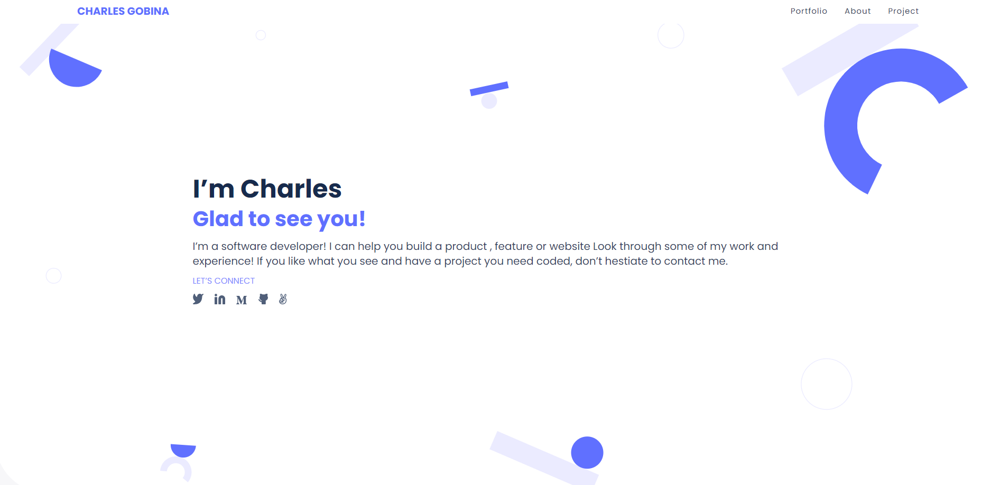

## My Portfolio 
This is part of my personal portfolio project. This project will test my understanding of flexbox, the gitflow, CSS grid and making pull requests.

## Built With
* HTML
* CSS
* Figma
* JavaScript

## Live Demo
* [Demo](https://charlesgobina.github.io/my-portfolio/)

## Authors
:student: Charles Gobina 
* Github:https://github.com/charlesgobina 
* Twitter:https://twitter.com/i4mCloud
* LinkedIn:https://www.linkedin.com/in/charles-gobina-74a0ab193/

## Contributing :handshake:
Contributions, issues, and feature requests are welcome!
* Fork the project
* Create a new "feature" branch
* Commit changes
* Open pull request

## Show your support
Give a 	:star: if you like this project.

## Acknowledgments
* Hat tip to anyone whose code was used
* Inspiration
* etc

## License :memo:
This project is [MIT](https://github.com/microverseinc/readme-template/blob/master/MIT.md) licensed
 
